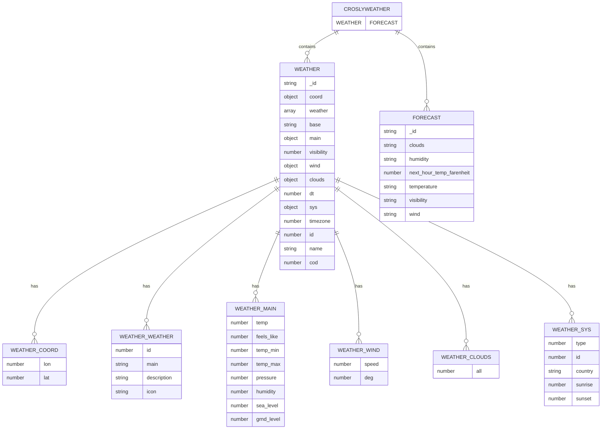

Kuyper Reynolds
IT 2055C
Brian Krahenbuhl
29 July 2024

# Final Project

## Database Platform
The database platform utilized in this application is MongoDB.

## Database Purpose
This database application answers the question: What's it like on top of Crosley Tower? Utilizing publicly available weather data via a JSON endpoint, it will poll and store weather data for the specific coordinates of Crosley Tower so that users can always know what the weather is like there.

The application will also feature a weather forecast using modern, commonly accepted techniques of weather forecasting... /s

## Database Model

## Reflection
I've completed many small projects in Python like this, so the biggest challenge was determining the purpose of the database application and sourcing data to demonstrate my ability to create, update, and delete documents in MongoDB. However, I found OpenWeather's free API, which allows 1,000 free daily calls. Combining this with the low-cost "gpt-3.5-turbo" chat completions endpoint that OpenAI offers allowed me to complete database operations with real-world data. Having dynamic data like this helps keep the project exciting and fun!

This project's most significant learning outcome is the absolute ease of use that MongoDB with Python drivers offers for quick development. I had database CRUD operations up and running within ten minutes of starting the project. This simplicity allowed me to focus on the logic and data processing to handle the application functionality instead of spending a ton of time writing entity models or database IO functionality.

In the future, I would be more specific about the data I store in the database to allow for longer retention of historical weather data. For this project, I leveraged MongoDB's ability to store any object in a document easily. However, to scale the application up, documents could be more efficient, allowing for less storage usage.
